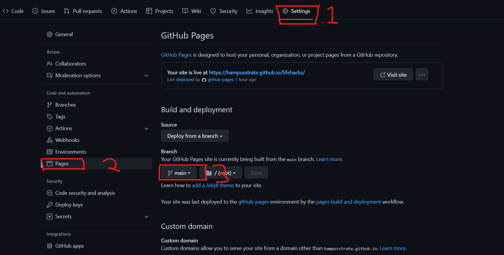

#  _The Study Hacks Projcet_

Study For Everyone is a webpage about diffrent hacks that students can use in order to maximize their studies and sessions.
It's a service that is very easy optanible and the hacks that we recommend is very easy for everyone to do from al ages and in all diffrent places.
This project i created for the HTML & CSS exam on Code Institute.

Here is how i created <a href="https://hampusstrate.github.io/lifehacks/" target="-blank" rel="noopener">Study For Everyone</a>

# Content
* Features
    * Home
    * Navigation Menu
    * Main page
    * Registration Form
    * Contact
* Technologies Used
* testing
* Deployment
    * To deploy the site

# Features
* Home
* Navigation Menu
    * I created a one page website but wanted to include a navigation menu for the convinience of the user so that the user can use the website very easy and navigate to the page that they want to go to.
    * It's easy to use and gets you directly to the part of the page that you were looking for. The logo text of the page takes you back to the main page.
* Main page
    * The start of the page talks a little bit about us and what we do.
* Registration form
    * The registration form is a way for people to register for the weekly mail with information about the newest study hacks that will improve the users studys.
    * Right now it dosen't register the information of the user.
* Contact
    * Here we have to contact information and also our social media links for people to see what we do on other platforms like.
# Testing page
* Here is the testing page for the site <a href="testing.md">Here</a>

# Technologies used
* HTML5- I used HTML to be able to create the website and giving it content.
* CSS- I used CSS to style and make the website look apeling to users.  
* Balsamic- Balsamic helped me create a base to go after so i knew what to focus on.
* Github- So i could publish my work and have a safe place to store the content.
* Gitpod- The place were i worked on the project and did all the changes.

# Deployment
## Deploy the site
   #### 1. In the github repositery click on seetings.
   #### 2. Navigate to the pages section on the left side.
   #### 3. Under the source section choose the main branch then click save.
   #### 4. When you select the master branch refresh the page to get the link.

The Link to the deployd website: https://hampusstrate.github.io/lifehacks/

### Fork the site
#### 1. Go to github and find the repositery or click on this link : https://github.com/HampusStrate/lifehacks
#### 2. On the top right side of the page you will find the fork button that allows you to fork the website.

### Copy the site
#### 1. Go to github and find the repositery or click on this link: https://github.com/HampusStrate/lifehacks
#### 2. To the right you will find the copy button and there you will get the link to the file.

# Credits
* The font is taken from: https://fonts.google.com/ and named Playfair Display
* Balsamiq was used to creat a base for the project for me to work after i did do some chanegs along the way but was a very good help.
 * The inspiration for the site i got from Code Institute from the exemple texts.

 # Media
 * The photos came from: https://www.pexels.com/sv-se/ that is a very good website hade some problems with the sizes of the image.

 # Acknowledgements
 This website was created as a portfolio project for Code Institue as project 1 for The Full Stacked Develpoer course with Code Institute. I would also like to thank my mentor Precious Ijege who have been there to help me and support me with my work.